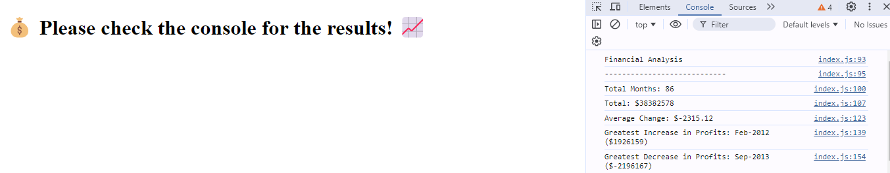

# Console-Finances

## Description
The Console Finance Tool presents analysis of the previously given financial records of a company. Available dataset was composed of Date and Profit/Losses data. The tool is enable to show the total months included in dataset, the net total amount of Profit/Losses over the entire period, the average of the changes in Profit/Losses over the entire period. It also defines the greatest increase in profits and the greatest decrease in losses over the entire period.

## Prerequisites
N/A

## Criteria
* Calculate the total number of months included in the dataset.
* Calculate the net total amount of Profit/Losses over the entire period.
* Calculate the average of the changes in Profit/Losses over the entire period.
* Calculate the greatest increase in profits (date and amount) over the entire period.
* Calculate the greatest decrease in profits (date and amount) over the entire period.
 
 ## Technologies Used
 Built with:
* HTML
* JavaScript

## Installation
N/A

## Usage
To use this Console Finance tool, open the Chrome DevTools by pressing Command+Option+I (macOS) or Control+Shift+I (Windows). A console panel should open either below or to the side of the webpage in the browser. There you will see the results of the total number of months included in the dataset, the average of the changes in profit/losses over the entire period, greatest increase in profits (date and amount) over the entire period and greatest decrease in profits (date and amount) over the entire period. 

## Project Link
Application can can be viewed here: 
* [Live](https://yvonnesarah.github.io/Console-Finances/)

* [Repository](https://github.com/yvonnesarah/Console-Finances)

## Screenshot
Console Finances

## Credit
N/A

## Licence
Please refer to the LICENSE in the repo.
